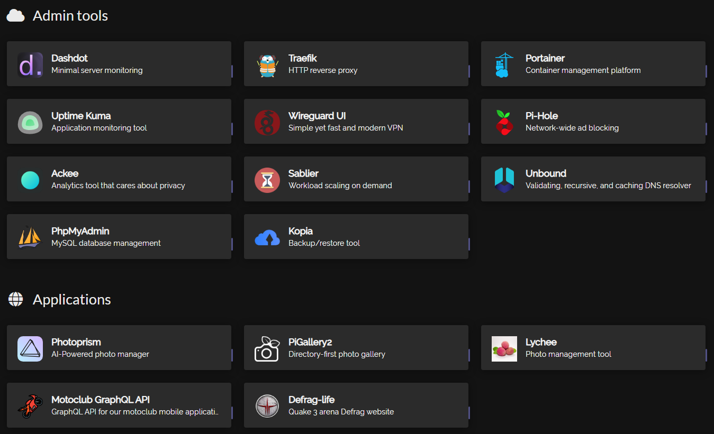
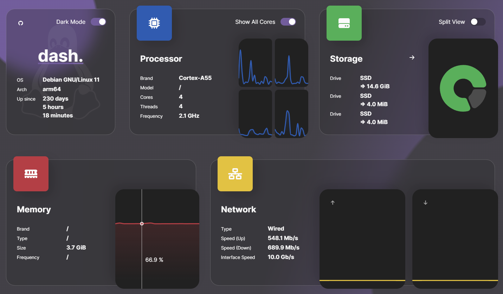
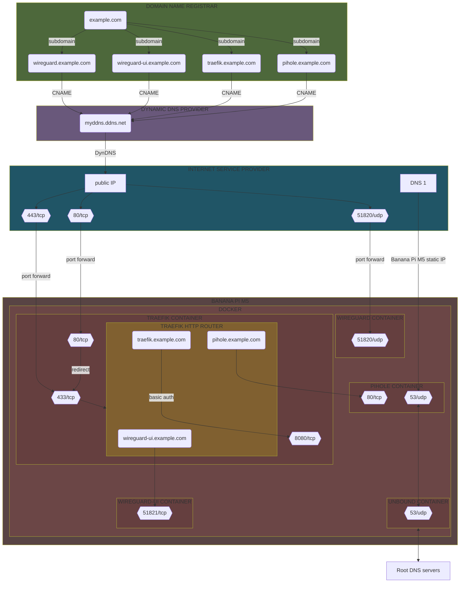
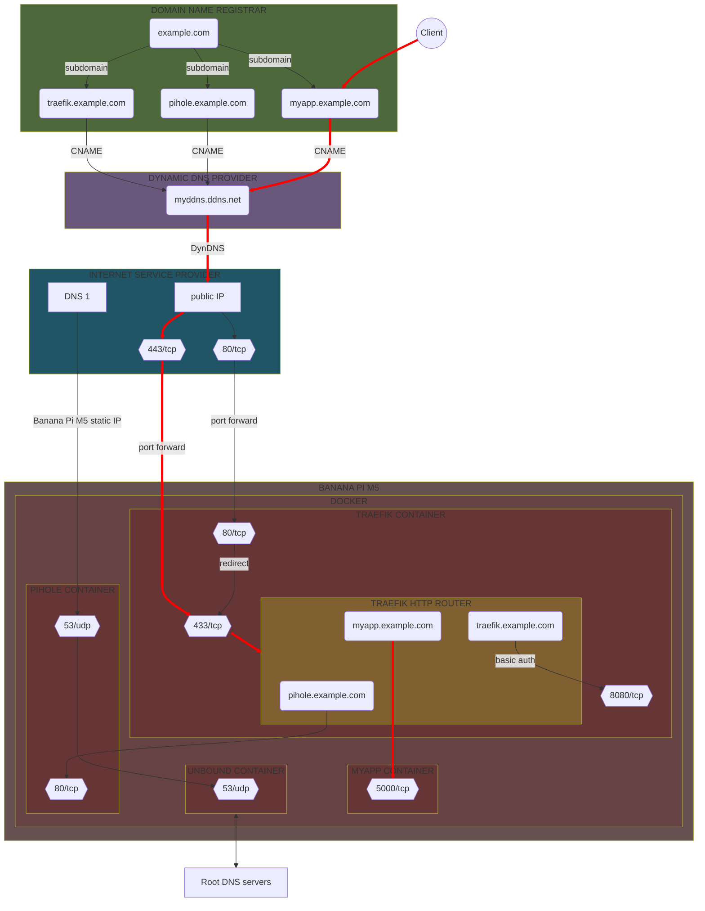
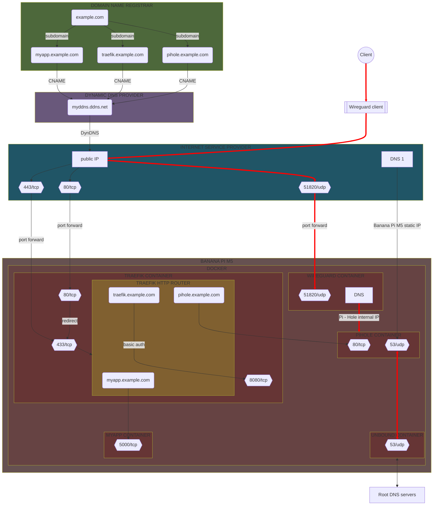

# Self-hosting guide


This project describe my self-hosted infrastructure setup, running on a **Banana Pi M5** board.

It uses only free and open source software :

|                                       Logo                                        | Name           | Repository                                  | Description                                          |
|:---------------------------------------------------------------------------------:|----------------|---------------------------------------------|------------------------------------------------------|
|                  | Docker         | https://github.com/docker                   | Help to build, share, and run container applications |
|  | Docker Compose | https://github.com/docker/compose           | Run multi-container applications with Docker         |
|            | Portainer      | https://github.com/portainer/portainer      | Management platform for containerized applications   |
|                | Sablier        | https://github.com/acouvreur/sablier        | Workload scaling on demand                           |
|                | Traefik        | https://github.com/traefik/traefik          | Modern HTTP reverse proxy and load balancer          |
|            | Wireguard      | https://github.com/WireGuard                | Simple yet fast and modern VPN                       |
|         | Wireguard UI   | https://github.com/ngoduykhanh/wireguard-ui | Web user interface to manage WireGuard setup         |
|                 | Pi-hole        | https://github.com/pi-hole/pi-hole          | Network-wide ad blocking                             |
|                | Unbound        | https://github.com/NLnetLabs/unbound        | Validating, recursive, and caching DNS resolver      |
|        | Uptime Kuma    | https://github.com/louislam/uptime-kuma     | Easy-to-use self-hosted monitoring tool              |
|                    | Homer          | https://github.com/bastienwirtz/homer       | Static application dashboard                         |
|                | Dashdot        | https://github.com/MauriceNino/dashdot      | Minimal server dashboard and monitoring              |
|                    | Ackee          | https://github.com/electerious/Ackee        | Analytics tool that cares about privacy              |
|          | Photoprism     | https://github.com/photoprism/photoprism    | AI-Powered photo manager                             |
|                  | Lychee         | https://github.com/LycheeOrg/Lychee         | Free photo-management tool                           |
|          | PhpMyAdmin     | https://github.com/phpmyadmin/phpmyadmin    | Web user interface to manage MySQL databases         |
|                    | Kopia          | https://github.com/kopia/kopia              | Fast and secure open-source backup/restore tool      |

# Table of Content

1. [Banana Pi M5 initial setup](#banana-pi-m5-initial-setup)
    1. [Install Android on the eMMC storage](#install-android-on-the-emmc-storage)
    2. [Format the eMMC storage](#format-the-emmc-storage)
    3. [Install Armbian on the MicroSD](#install-armbian-on-the-microsd)
    4. [Install Armbian on the eMMC storage](#install-armbian-on-the-emmc-storage)
2. [Prepare Armbian system](#prepare-armbian-system)
    1. [Some cleaning](#some-cleaning)
    2. [Docker & Docker Compose](#docker--docker-compose)
3. [Prepare network configuration](#prepare-network-configuration)
    1. [Port forwarding](#port-forwarding)
    2. [Dynamic DNS](#dynamic-dns)
    3. [Domain and subdomains](#domain-and-subdomains)
4. [Install tools](#install-tools)
    1. [Traefik](#traefik)
    2. [Portainer](#portainer)
    3. [PhpMyAdmin](#phpmyadmin)
5. [Install services](#install-services)
    1. [Homer](#homer)
    2. [Dashdot](#dashdot)
    3. [Uptime Kuma](#uptime-kuma)
    4. [Ackee](#ackee)
6. [Install applications](#install-applications)

# Banana Pi M5 initial setup

<div style="display:flex;flex-flow:row wrap;align-items:center; gap:40px">
  
  
  
</div>

## Install Android on the eMMC storage

Installing **Android** is optional, you can directly [format the eMMC storage](#format-the-emmc-storage)
then [install Armbian on the eMMC storage](#install-armbian-on-the-emmc-storage), you will still need to execute some of the steps described below.

From your machine (Windows in my case) :

- Download **Amlogic USB Burning Tool** v3.1.0 (v3.2.0 seem not to work, error is raised while loading the image)
- Download latest **Android** image for Banana Pi M5 : _2023-03-01-bpi-m5-m2pro-tablet-android9.img.zip_
- Extract it to get the _2023-03-01-bpi-m5-m2pro-tablet-android9.img_ file
- Execute Amlogic USB Burning Tool as Administrator
- Load Android image from "Setting -> Load img" menu
- Press **SW4** button on the Banana Pi for 2/3s (don't know why and if it is really necessary, but it is specified in the doc)
- Connect the USB cable from PC to Banana Pi
- Device should be detected in Amlogic USB Burning Tool, just click "Start" and wait for the operation to complete
- Unplug the USB cable from Banana Pi and PC
- Plug in the USB-C power cable to the Banana Pi, it should boot on Android

## Format the eMMC storage

- Same steps as above ([Install Android on the eMMC storage](#install-android-on-the-emmc-storage)) but unplug the USB cable during the "Formatting" step (not too early and not too
  late, had to do it multiple times until it worked)
- Plug in the USB-C power cable to the Banana Pi, it should boot on the MicroSD card, indeed the Banana Pi will boot on the MicroSD card only if the eMMC storage is empty

## Install Armbian on the MicroSD

Installation on the **MicroSD** is optional, you can directly [install Armbian on the eMMC storage](#install-armbian-on-the-emmc-storage).

From your machine (Windows in my case) :

- Download latest **Armbian** image for Banana Pi M5 : _Armbian_23.02.2_Bananapim5_bullseye_current_6.1.11_gnome_desktop.img.xz_
- Extract it to get _Armbian_23.02.2_Bananapim5_bullseye_current_6.1.11_gnome_desktop.img_ file
- Connect the MiroSD card to the PC
- Download **Rufus** (3.21 when writing this) or equivalent software to be able to write the image to the MicroSD card
- Simply select the image in Rufus and write it to the MicroSD card with the default proposed options
- Insert the MicroSD card into the Banana Pi and plug in the USB power cable, this should boot on Armbian on the MicroSD card

## Install Armbian on the eMMC storage

- Plug in the USB-C power cable of the Banana Pi M5 to boot on Armbian in the MicroSD card
- Put the Armbian image in the Banana Pi MicroSD card storage (through USB key or network or whatever), for example in _/home/yann/Documents_
- Run `fdisk -l` command to identify the **eMMC** path, should be something like _/dev/mmcblk1_
- Burn the image to the eMMC storage by running the command :
    ```bash
    sudo dd if=Armbian_23.02.2_Bananapim5_bullseye_current_6.1.11_gnome_desktop.img of=/dev/mmcblk1 bs=10MB
    ```
- Remove the MicroSD card and reboot the Banana Pi M5, it should boot on Armbian on the eMMC storage

# Prepare Armbian system


## Some cleaning

Armbian come with default installed software that we will not use, let's remove related packages to save disK space.

1. Upgrade packages :

    ```bash
    sudo apt update
    sudo apt upgrade
    ```

2. Remove packages we don't need :

    ```bash
    sudo apt purge --auto-remove gimp
    sudo apt purge --auto-remove hexchat
    sudo apt purge qbittorrent
    sudo apt purge telegram-desktop
    sudo apt purge pithos
    sudo apt purge pidgin
    sudo apt purge thunderbird
    sudo apt purge --auto-remove geany
    sudo apt purge meld
    sudo apt purge libreoffice*
    sudo apt purge --auto-remove mc
    sudo apt purge --auto-remove transmission
    sudo apt purge transmission-remote-gtk
    sudo apt remove kazam
    sudo apt remove remmina
    sudo apt remove codium
    sudo apt remove mpv
    sudo apt remove sysstat
    sudo apt autoremove
    sudo apt autoclean
    ```

Then we can also remove **unneeded locales** to save some more space, using the `localepurge` tool. `localepurge` is a small script to recover disk space wasted for unneeded locale
files and localized man pages.

Install the package :

```bash
sudo apt install localepurge
```

This will automatically run the script to allow selecting the locales we want to keep, i.e. I selected :

```
en
en_US.UTF-8
fr
fr_CH.UTF-8
```

Any locale you have not selected will be purged.

If you need to run it again, execute :

```bash
sudo dpkg-reconfigure localepurge
```

You can also use the **BleachBit** utility, installed by default on Armbian, to clean the system, i.e. I run it with following options checked :

- `autoclean` : delete obsolete files
- `autoremove` : delete obsolete files
- `clean` : delete the APT cache
- `package lists` : delete the package list cache
- `journald` :
    - `clean` : clean old system journals
- `system`
    - `broken desktop files` : delete broken application menu entries and file associations
    - `cache` : delete system cache
    - `localizations` : delete files for unwanted languages
    - `rotated logs` : delete old system logs
    - `temporary files` : delete the temporary files
    - `trash` : empty the trash

All of this should have saved some megabytes and unnecessary disk I/O.

## Docker & Docker Compose

<div style="display:flex;flex-flow:row wrap;align-items:center; gap:40px">
  
  
</div>

We will use **Docker** to containerize and run our different applications.

Docker provides an installation script, just run it :

```bash
curl -fsSL https://get.docker.com -o get-docker.sh
sudo sh get-docker.sh
sudo docker version
sudo rm get-docker.sh
```

Then also install **Docker-Compose**, so we can define and run multi-container Docker applications :

```bash
sudo apt install docker-compose -y
sudo docker-compose version
```

# Prepare network configuration

Before installing our services, we need to configure the network, so we can reach our applications from the internet.

## Port forwarding

We need to forward incoming requests to our Banana Pi board (will be then handled by **Traefik** reverse proxy).

Go to your router configuration and add a **port forward rule** for the port `80` :

- Name : Traefik
- Input port : 80
- Target port : 80
- Device : bananapim5
- Protocol : TCP

and `443` (website must be reachable from the internet to generate the **SSL** certificate) :

- Name : Traefik SSL
- Input port : 443
- Target port : 443
- Device : bananapim5
- Protocol : TCP

## Dynamic DNS

When connecting from outside our network (from the internet), we need to know the public IP address of our router to connect.
But as we are getting dynamically-assigned public IP addresses (via DHCP), we would need to update the configuration everytime the IP changes, which is very uncomfortable.
Fortunately we can register a dynamic host record (DynDNS), and set it in our router configuration so that when the public IP address changes, a call is made to the DynDNS service
provider to update the record. That way our network will always be reachable from the internet via the DynDNS record no matter the IP address.

Register a **dynamic DNS** hostname from a free provider, for example **No-IP** https://my.noip.com/ :

- hostname : `myddns.ddns.net`
- IP / target : _internet box external IP_
- type : `A`

Then activate **DynDNS** on the router :

- Service provider : `No-IP`
- Hostname : `myddns.ddns.net`
- Username : _xxxxxxxx_
- Password : _xxxxxxxx_

The IP will be updated automatically when a change will be detected.

## Domain and subdomains

You will need to buy a domain from you preferred domain provider, for example `example.com`.

Then create **subdomains** from the domain provider settings :

- `traefik.example.com` : To access the [Traefik](#traefik) dashboard
- `portainer.example.com` : To access the [Portainer](#portainer) application
- `phpmyadmin.example.com` : To access the [PhpMyAdmin](#phpmyadmin) application


- `dashboard.example.com` : To access the [Homer](#homer) application
- `dashdot.example.com` : To access the [Dashdot](#dashdot) application
- `uptime-kuma.example.com` : To access the [Uptime Kuma](#uptime-kuma) application

Add **CNAME records** to point to dynamic DNS `myddns.ddns.net` :

- `CNAME	traefik	        myddns.ddns.net`
- `CNAME	portainer	    myddns.ddns.net`
- `CNAME	phpmyadmin	    myddns.ddns.net`


- `CNAME	dashboard	    myddns.ddns.net`
- `CNAME	dashdot	        myddns.ddns.net`
- `CNAME	uptime-kuma	    myddns.ddns.net`

# Install tools

## Traefik


We will use **Traefik** as reverse proxy to intercept and route every incoming request to the corresponding backend services.

### Setting up

Create a folder to hold data and configuration :

```bash
sudo mkdir /opt/apps/traefik
```

As we use automatic **Let's Encrypt** certificates generation, we need to create a `acme.json` file that will hold the generated certificates (file is mapped to a volume in the
**Compose** file), so that the certificates are persisted between container restarts (not generated each time which could raise Let's Encrypt rate limits), we also need to change
the permissions so Traefik can access and edit this file :

```bash
cd /opt/apps/traefik
touch /opt/apps/traefik/acme.json
chmod 600 /opt/apps/traefik/acme.json
```

Then copy the files from this project's _traefik_ directory into the _/opt/apps/traefik_ directory :

- _docker_compose.yml_ : The Traefik service definition
- _traefik.yml_ : The Traefik static configuration
- _credentials.txt_ : A file that will hold users credentials to access the Traefik dashboard (restricted with **basic authentication**)

Simply replace the e-mail address (`admin@example.com`) in the _traefik.yaml_ file.

### Details

Basically the Traefik static configuration file :

- enables the Traefik **dashboard**
- defines 2 **entrypoints**, named `web` (for port `80`) and `websecure` (for port `443`)
- defines a `docker` provider so that we can use **container labels** to retrieve routing configuration. We have configured it to **not** expose containers by default, so
  that containers that do not have a `traefik.enable=true` label are ignored from the resulting routing configuration
- defines a `default` **certificate resolver** for Let's Encrypt to automatically generate certificates (requested through **HTTP Challenge**)

And the Docker service definition :

- exposes ports `80` and `443` to receive incoming HTTP/HTTPS requests
- defines a `traefik-net` **network** (which will have to be shared with the services that will use Traefik)
- defines an HTTP **router** that will match `traefik.example.com` URL on our `websecure` **entrypoint** to point to our service
- defines `httpsonly` **router** and **middleware** responsible for automatically redirecting HTTP requests to HTTPS
- configures `dashboard` and `api` routers to use secure HTTPS endpoint with our certificate resolver to generate related Let's Encrypt certificates
- secures dashboard and API endpoints by defining a `auth` middleware that will handle basic authentication (from _credentials.txt_ file)

### Generate basic authentication credentials

As we configured the Traefik dashboard to be protected with basic authentication, allowed users have to be added to the _credentials.txt_ file.

You can generate a user/password using **htpasswd** :

1. Install the needed package if not present :

    ```bash
    sudo apt-get install apache2-util
    ```

2. Generate the credentials (we use **bcrypt** with a computing time of 10) :

    ```bash
    htpasswd -nbBC 10 admin xxxxxxxx
    ```

Then copy the output to the _credentials.txt_ file.

### Run

Finally, run the Compose file :

```bash
sudo docker-compose -f /opt/apps/traefik/docker_compose.yml up -d
# You may need to force recreate if you changed a config from an already running configuration
sudo docker-compose -f /opt/apps/traefik/docker_compose.yml up -d --force-recreate
```

You should end-up with a running `traefik` container.

It should also have generated the needed Let's Encrypt certificates in the _acme.json_ file.

So you can reach the dashboard at https://traefik.example.com.

## Portainer


We will use **Portainer** to easily manage our Docker containers.

### Setting up

Create a folder to hold the configuration :

```bash
sudo mkdir /opt/apps/portainer
```

Then simply copy the _docker-compose.yml_ file from this project's _portainer_ directory into the _/opt/apps/portainer_ directory.

### Details

Things to notice :

- Portainer's data is bound to a **Docker volume** named `portainer-vol`
- It uses Traefik **labels** to create :
    - a **service** which will point to our container application running on port `9000`
    - an HTTP **router** that will match `portainer.example.com` URL on our `websecure` **entrypoint** to point to our service
    - a **TLS** configuration that will use our `default` **certificates resolver**, so it can generate Let's encrypt certificates
- It runs in its own **network** (`portainer-net`) but must also share the same network as Traefik (`traefik-net`) so it can be auto discovered

### Run

Finally, simply run the Compose file :

```bash
sudo docker-compose -f /opt/apps/portainer/docker_compose.yml up -d
```

You should end-up with a running `portainer` container.

It should also have generated the needed Let's Encrypt certificates in the _acme.json_ file in the Traefik folder.

The application is available at https://portainer.example.com.

## PhpMyAdmin


As our services will use some MySQL/MariaDB databases, we will use **PhpMyAdmin** to easily manage our databases.

### Setting up

Create a folder to hold the configuration :

```bash
sudo mkdir /opt/apps/phpmyadmin
```

Then simply copy the _docker-compose.yml_ file from this project's _phpmyadmin_ directory into the _/opt/apps/phpmyadmin_ directory.

### Details

Things to notice :

- We mount a _theme_ directory to use a custom theme (dark theme named `darkwolf`), so just copy the theme data from official repository https://www.phpmyadmin.net/themes/
- It uses Traefik **labels** to create :
    - a **service** which will point to our container application running on port `80`
    - an HTTP **router** that will match `phpmyadmin.example.com` URL on our `websecure` **entrypoint** to point to our service
    - a **TLS** configuration that will use our `default` **certificates resolver**, so it can generate Let's encrypt certificates
- It runs in its own **network** (`phpmyadmin-net`) but must also share the same network as Traefik (`traefik-net`) so it can be auto discovered
- The `phpmyadmin` network will have to be added to any MySQL/MariaDB database container that we want to make reachable from PhpMyAdmin
- We set the environment variable `PMA_ARBITRARY` to `1` to tell PhpMyAdmin to allow connection to any arbitrary database server (we will be able to specify the server on login
  screen)

### Run

Finally, simply run the Compose file :

```bash
sudo docker-compose -f /opt/apps/phpmyadmin/docker_compose.yml up -d
```

You should end-up with a running `phpmyadmin` container.

It should also have generated the needed Let's Encrypt certificates in the _acme.json_ file in the Traefik folder.

The application is available at https://phpmyadmin.example.com.

# Install services

## Homer


**Homer** is a simple application that allows to generate a static homepage from a simple `yaml` configuration file.

We will use it as a dashboard to list our services.



### Setting up

First, create a folder to hold the configuration :

```bash
sudo mkdir /opt/apps/homer
```

Also create an _assets_ directory to hold the application assets and the main configuration file, it will be mounted in the container.

By default, on first run, it installs in this directory some example configuration files and assets (favicons, ...), we have disabled this by setting the environment
variable `INIT_ASSETS` to `0` (default `1`).

Note that this _assets_ directory **must** have the same **gid** / **uid** that the container user have (default `1000:1000`), so make sure to execute :

```bash
chown -R 1000:1000 /opt/apps/homer/assets/
```

Then copy :

- the _docker-compose.yml_ file from this project's _homer_ directory into the _/opt/apps/homer_ directory
- the _config.yml_ file from this project's _homer_ directory into the _/opt/apps/homer/assets_ directory

### Details

Things to notice :

- Homer's assets data is bound to a local directory named `assets`
- It sets the `INIT_ASSETS` environment variable to `0` to avoid generating default example data
- It sets a user with **uid** and **gid** `1000` to run the application in the container
- It uses Traefik **labels** to create :
    - a **service** which will point to our container application running on port `8080`
    - an HTTP **router** that will match `dashboard.example.com` URL on our `websecure` **entrypoint** to point to our service
    - a **TLS** configuration that will use our `default` **certificates resolver**, so it can generate Let's encrypt certificates
- It runs in its own network (`homer-net`) but must also share the same network as Traefik (`traefik-net`) so it can be auto discovered

### Run

Finally, simply run the Compose file :

```bash
sudo docker-compose -f /opt/apps/homer/docker_compose.yml up -d
```

You should end-up with a running `homer` container.

It should also have generated the needed Let's Encrypt certificates in the _acme.json_ file in the Traefik folder.

The application will be available at https://dashboard.example.com.

## Dashdot


**Dashdot** is a modern application to monitor server resources through a basic UI.



### Setting up

Create a folder to hold the configuration :

```bash
sudo mkdir /opt/apps/dashdot
```

Then simply copy the _docker-compose.yml_ file from this project's _dashdot_ directory into the _/opt/apps/dashdot_ directory.

### Details

Things to notice :

- Dashdot's data is bound to the current directory (read-only)
- It uses Traefik **labels** to create :
    - a **service** which will point to our container application running on port `3001`
    - an HTTP **router** that will match `dashdot.example.com` URL on our `websecure` **entrypoint** to point to our service
    - a **TLS** configuration that will use our `default` **certificates resolver**, so it can generate Let's encrypt certificates
- It runs in its own **network** (`dashdot-net`) but must also share the same network as Traefik (`traefik-net`) so it can be auto discovered

### Run

Finally, simply run the Compose file :

```bash
sudo docker-compose -f /opt/apps/dashdot/docker_compose.yml up -d
```

You should end-up with a running `dashdot` container.

It should also have generated the needed Let's Encrypt certificates in the _acme.json_ file in the Traefik folder.

The application is available at https://dashdot.example.com.

## Uptime-Kuma


**Uptime Kuma** is a monitoring tool allowing to monitor application uptime with a simple UI.

### Setting up

Create a folder to hold the configuration :

```bash
sudo mkdir /opt/apps/uptime-kuma
```

Then simply copy the _docker-compose.yml_ file from this project's _uptime-kuma_ directory into the _/opt/apps/uptime-kuma_ directory.

### Details

Things to notice :

- Uptime Kuma's data is bound to a **Docker volume** named `uptime-kuma-vol`
- It uses Traefik **labels** to create :
    - a **service** which will point to our container application running on port `3001`
    - an HTTP **router** that will match `uptime-kuma.example.com` URL on our `websecure` **entrypoint** to point to our service
    - a **TLS** configuration that will use our `default` **certificates resolver**, so it can generate Let's encrypt certificates
- It runs in its own **network** (`uptime-kuma-net`) but must also share the same network as Traefik (`traefik-net`) so it can be auto discovered

### Run

Finally, simply run the Compose file :

```bash
sudo docker-compose -f /opt/apps/uptime-kuma/docker_compose.yml up -d
```

You should end-up with a running `uptime-kuma` container.

It should also have generated the needed Let's Encrypt certificates in the _acme.json_ file in the Traefik folder.

The application is available at https://uptime-kuma.example.com.

## Ackee


**Ackee** is an analytics tool that analyzes the traffic of any website and provides useful statistics in a minimal interface.

We will connect it to our PHP website.

### Setting up

Create a folder to hold the configuration :

```bash
sudo mkdir /opt/apps/ackee
```

Then copy the _docker-compose.yml_ and _.env_ files from this project's _ackee_ directory into the _/opt/apps/ackee_ directory.

Note that Ackee requires correct **CORS headers** to be able to contact the target application, indeed :

- For security reasons the `Access-Control-Allow-Origin` header should only allow one domain
  ```
  Access-Control-Allow-Origin: https://quake.example.com
  ```
- _ackee-tracker_ needs the permission to send `GET`, `POST`, `PATCH` and `OPTIONS` requests to the server.
  ```
  Access-Control-Allow-Methods: `GET`, `POST`, `PATCH`, `OPTIONS`
  ```
- The `Access-Control-Allow-Headers` header is used in response to a preflight request to indicate which HTTP headers can be used when making the actual request.
  ```
  Access-Control-Allow-Headers: Content-Type, Authorization, Time-Zone
  ```
- The `Access-Control-Allow-Credentials` header tells the browser to include the ackee_ignore cookie in requests even when you're on a different (sub-)domain. This allows Ackee to
  ignore your own visits.
  ```
  Access-Control-Allow-Credentials: true
  ```
- The `Access-Control-Max-Age` header tells the browser that all `Access-Control-Allow-*` headers can be cached for one hour. This minimizes the amount of preflight requests.
  Access-Control-Max-Age: 3600

These are all set using **Traefik labels** in the Docker service definition.

### Details

Things to notice :

- Uptime Kuma's data is stored in a **MongoDB** database which will run in its own container named `ackee-mongodb`. MongoDB's data is bound to a _data_ directory in the current
  directory
- It uses Traefik **labels** on the `ackee-app` container to create :
    - a **service** which will point to our container application running on port `3001`
    - an HTTP **router** that will match `uptime-kuma.example.com` URL on our `websecure` **entrypoint** to point to our service
    - a `corsheaders` middleware to set the CORS configuration required by Ackee
    - a **TLS** configuration that will use our `default` **certificates resolver**, so it can generate Let's encrypt certificates
- It runs in its own **network** (`uptime-kuma-net`) but must also share the same network as Traefik (`traefik-net`) so it can be auto discovered

### Run

Finally, simply run the Compose file :

```bash
sudo docker-compose -f /opt/apps/uptime-kuma/docker_compose.yml up -d
```

You should end-up with 2 running containers :

- `ackee-app` container holding the application
- `ackee-mongodb` container holding the MongoDB database

It should also have generated the needed Let's Encrypt certificates in the _acme.json_ file in the Traefik folder.

The application is available at https://ackee.example.com.

# Install applications

## Photoprism


Create a directory to hold the app :

```bash
mkdir /opt/apps/photoprism
cd /opt/apps/photoprism
```

Get compose file for **ARM64** systems :

```bash
wget https://dl.photoprism.app/docker/arm64/docker-compose.yml
```

Or use the one from this project (_photoprism/docker-compose.yml_).

Here are the modifications done to the default provided docker-compose :

- Added `container_name: photoprism-app` to the photoprism service and `container_name: photoprism-db` to the mariadb service
- Set Photoprism admin password by changing the value of the `PHOTOPRISM_ADMIN_PASSWORD` property
- Set Database "photoprism" user password by changing the value of the `PHOTOPRISM_DATABASE_PASSWORD` and `MARIADB_PASSWORD` properties
- Set database root password by changing the value of the `MARIADB_ROOT_PASSWORD` property
- Set site URL by changing the value of the `PHOTOPRISM_SITE_URL` property to https://photos-admin.example.com
- Disabled Webdav
- Added networks :

    ```yaml
    photoprism:
      networks:
        - photoprism-net
        - traefik-net
  
    mariadb:
      networks:
        - photoprism-net
  
    networks:
      photoprism-net:
        name: photoprism-net
      traefik-net:
        name: traefik-net
      external: true
    ```
- Added Traefik labels to the photoprism service:

    ```yaml
    photoprism:
      labels:
        - "traefik.enable=true"
        - "traefik.http.routers.photoprism.rule=Host(`photos-admin.example.com`)"
        - "traefik.http.routers.photoprism.entrypoints=websecure"
        - "traefik.http.routers.photoprism.tls.certresolver=default"
        - "traefik.http.services.photoprism.loadbalancer.server.port=2342"
        - "traefik.docker.network=traefik-net"
    ```

Start :

```bash
sudo docker compose up -d
 ```

This will create 2 containers :

- A container holding the **MariaDB** database, not exposed
- A container holding the application, exposed on port **2342**

## Chachatte Team

Create a directory to hold the app :

```bash
mkdir /opt/apps/chachatte-team
cd /opt/apps/chachatte-team
```

Create the _Dockerfile_ and _docker-compose.yml_ files based on the files in the _chachatte-team_ folder in this project.

In the same directory, create a _.env_ file to hold the environment variables :

```text
MARIADB_ROOT_PASSWORD=password
MARIADB_DATABASE=chachatte_team
MARIADB_USER=chachatte
MARIADB_PASSWORD=password
SPRING_PROFILES_ACTIVE=prd
```

Move the application JAR file (_chachatte-team-graphql.jar_) into the current directory.

Start :

```bash
sudo docker-compose up -d
```

This will create 2 containers :

- A container holding the **MariaDB** database, exposed on port **3306**
- A container holding the **Java** application (based on the provided _Dockerfile_), exposed on port **5001**

# Limit access through VPN

We will install Wireguard, Unbound, Pi-hole

In Pi-Hole go to Settings -> Interface settings and choose "Permit all origins" so that traffic from wireguard can be seen.
Go to local DNS -> DNS records and add DNS record for every subdomain :

```
ackee.example.com 192.168.0.17
chachatte.example.com 192.168.0.17
```

## Wirehole

Create a new client from Wireguard UI :
`Yann-home-desktop`
export file
install Wireguard client on client machine
load file from client

Install **Wirehole** :

```bash
sudo mkdir /opt/apps
cd /opt/apps/
sudo git clone https://github.com/IAmStoxe/wirehole.git
cd wirehole
```

Edit _docker-compose.yml_ file :

```bash
> sudo vi docker-compose.yml
```

And :

- set timezone to `Europe/Zurich`
- change **PiHole** password

Start :

```bash
> sudo docker-compose up
```

Reach http://10.2.0.100/admin

Here is the wirehole generated configuration in my case :

- subnet : `10.2.0.0/24`
    - PiHole : `10.2.0.100`
    - Unbound : `10.2.0.200`
    - Wireguard : `10.2.0.3`
        - Internal subnet : `10.6.0.0`
            - wg0 :
                - interface : `10.6.0.1`
                - peer allowed IPs : `10.6.0.2/32`
            - peer1 :
                - interface : `10.6.0.2` (DNS : `10.2.0.100`)
                - peer allowed IPs : `0.0.0.0/0` (endpoint : `144.2.94.78:51820`)

Configure your devices to use PiHole, This can be done in one of 3 ways:

- Network-wide at the router level
- Network-wide with the PiHole as DHCP
- Specific devices only

Go to your router configuration and add a **port forward rule** for the port `51820` :

- Name : VPN
- Input port : 51820
- Target port : 51820
- Device : bananapim5
- Protocol : UDP

Wireguard UI

In Global settings, set endpoint address to wireguard.example.com
Set DNS server as `10.2.0.100` (Pi hole) instead of `1.1.1.1` (Cloudflare)
In Wireguard Server settings, set Server Interface address as `10.10.1.1/24`
Post Up Script

```
iptables -A FORWARD -i %1 -j ACCEPT; iptables -A FORWARD -o wg0 -j ACCEPT; iptables -t nat -A POSTROUTING -o eth+ -j MASQUERADE
```

Post Down Script

```
iptables -D FORWARD -i %1 -j ACCEPT; iptables -D FORWARD -o wg0 -j ACCEPT; iptables -t nat -D POSTROUTING -o eth+ -j MASQUERADE
```

In Wireguard clients settings, create a new client :
name :  Yann-desktop-home
e-mail
should propose IP allocation of `10.10.1.2/32` for first client, then `10.10.1.3/32`, etc.
Allowed IPs : set it to `0.0.0.0/1, 128.0.0.0/1` to reroute all traffic to DNS,
by default `0.0.0.0/0` will block untunneled traffic (block all traffic from taking a route that isn't the tunnel)
Using /1 instead of /0 ensure that it takes precedence over the default /0 route.

# Network architecture







1. Forward port 51820 to your Pi's local IP address
2. Set your primary DNS in your DHCP server settings to your Pi's local IP. Leave the secondary DNS blank (remove 195.186.4.192).