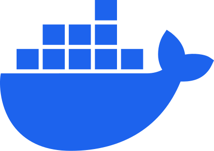
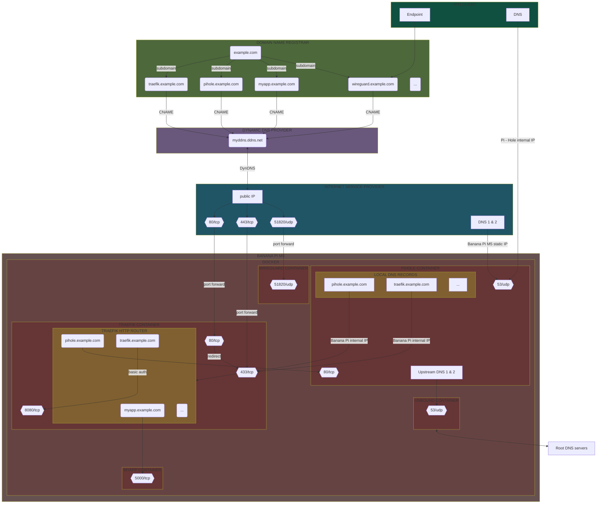
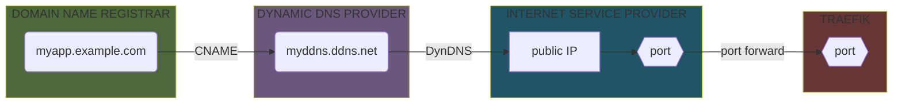
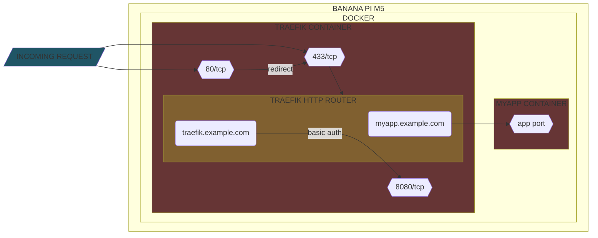
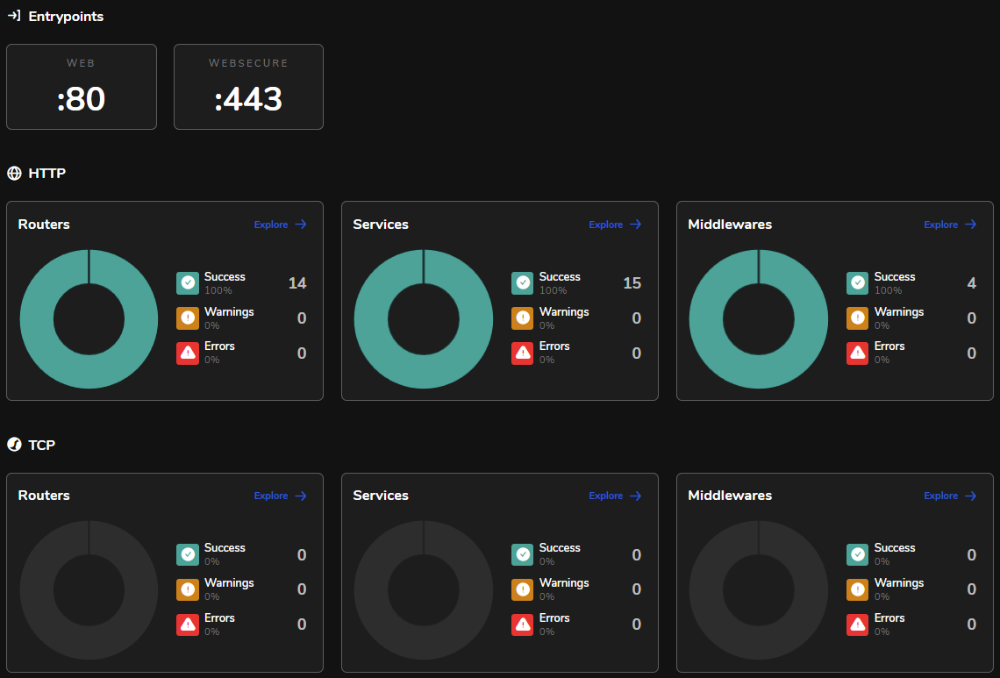

# Personal self-hosting guide


This project describes my personal **self-hosted** infrastructure setup, running on a **Banana Pi M5** board.

It uses only **free** and **open source** software and hardware.

<table>
  <tr>
    <td>
      <picture>
        <source media="(prefers-color-scheme: dark)" srcset="images/logo-open-source-initiative.svg" height="128"/>
        <source media="(prefers-color-scheme: light)" srcset="images/logo-open-source-initiative-black.svg" height="128"/>
        
      </picture>
    </td>
    <td>
      
    </td>
  </tr>
</table>

> [!IMPORTANT]
> The content of this repository is provided "as is", there is no guarantee that the information is complete or error-free,
> nor that it will meet your needs.
> The techniques and tools discussed here come with inherent risks.
> The author takes absolutely no responsibility for possible consequences due to the use of the related software.

# Table of Content

1. [Overview](#overview)
    1. [Plan](#plan)
    2. [Architecture](#architecture)
2. [Banana Pi M5 initial setup](#banana-pi-m5-initial-setup)
    1. [Install Android on the eMMC storage](#install-android-on-the-emmc-storage)
    2. [Format the eMMC storage](#format-the-emmc-storage)
    3. [Install Armbian on the MicroSD](#install-armbian-on-the-microsd)
    4. [Install Armbian on the eMMC storage](#install-armbian-on-the-emmc-storage)
3. [Prepare system](#prepare-system)
    1. [Cleaning](#cleaning)
    2. [Docker & Docker Compose](#docker--docker-compose)
4. [Network configuration](#network-configuration)
    1. [IP settings](#ip-settings)
    2. [Dynamic DNS](#dynamic-dns)
    3. [Domain and subdomains](#domain-and-subdomains)
    4. [Port forwarding](#port-forwarding)
5. [Install tools](#install-tools)
    1. [Traefik](#traefik)
    2. [Portainer](#portainer)
    3. [PhpMyAdmin](#phpmyadmin)
6. [Install services](#install-services)
    1. [Homer](#homer)
    2. [Dashdot](#dashdot)
    3. [Uptime Kuma](#uptime-kuma)
    4. [Ackee](#ackee)
7. [Install applications](#install-applications)
    1. [Defrag-life](#defrag-life)
    2. [Chachatte Team API](#chachatte-team-api)
8. [Add VPN with ad blocking and DNS caching](#add-vpn-with-ad-blocking-and-dns-caching)

# Overview

## Plan

I started this project in late 2023 as a **home lab**, for learning, the goal was to have an environment :

- **100% self-hosted** (privacy preserving, full control over data and software)
- **Secure** (authentication, SSL/TLS, reverse proxy, firewall, ad blocking, DDOS protection, rate limiting, custom DNS resolver, ...)
- **Lightweight** (runs smoothly with minimal hardware and software requirements)
- **Container-ready** (isolated, portable, scalable applications)
- **Accessible** (some services only locally, some only through VPN, some publicly)
- **Supervised** (monitoring, alerting, tracking, backup tools)

These are the tools we are going to run :

|                                       Logo                                        | Name           | Repository                                  | Description                                          |
|:---------------------------------------------------------------------------------:|----------------|---------------------------------------------|------------------------------------------------------|
|                  | Docker         | https://github.com/docker                   | Help to build, share, and run container applications |
|  | Docker Compose | https://github.com/docker/compose           | Run multi-container applications with Docker         |
|            | Portainer      | https://github.com/portainer/portainer      | Management platform for containerized applications   |
|                | Sablier        | https://github.com/acouvreur/sablier        | Workload scaling on demand                           |
|                | Traefik        | https://github.com/traefik/traefik          | Modern HTTP reverse proxy and load balancer          |
|            | Wireguard      | https://github.com/WireGuard                | Simple yet fast and modern VPN                       |
|            | Wireguard UI   | https://github.com/ngoduykhanh/wireguard-ui | Web user interface to manage WireGuard setup         |
|                 | Pi-hole        | https://github.com/pi-hole/pi-hole          | Network-wide ad blocking                             |
|                | Unbound        | https://github.com/NLnetLabs/unbound        | Validating, recursive, and caching DNS resolver      |
|        | Uptime Kuma    | https://github.com/louislam/uptime-kuma     | Easy-to-use self-hosted monitoring tool              |
|                    | Homer          | https://github.com/bastienwirtz/homer       | Static application dashboard                         |
|                | Dashdot        | https://github.com/MauriceNino/dashdot      | Minimal server dashboard and monitoring              |
|                    | Ackee          | https://github.com/electerious/Ackee        | Analytics tool that cares about privacy              |
|                  | Lychee         | https://github.com/LycheeOrg/Lychee         | Free photo-management tool                           |
|          | PhpMyAdmin     | https://github.com/phpmyadmin/phpmyadmin    | Web user interface to manage MySQL databases         |
|                    | Kopia          | https://github.com/kopia/kopia              | Fast and secure open-source backup/restore tool      |

And also some personal applications :

- My first **PHP** / **MySQL** website from the early 2000's ! : https://github.com/Yann39/defrag-life
- A **GraphQL API**  (**Java** / **Spring Boot**) for my **Flutter** mobile application : https://github.com/Yann39/chachatte-team

Yes, all of this runs on a single **Banana Pi M5 board** ! With the following specifications :

<table>
  <tr>
    <td>
      
    </td>
    <td>
      <ul>
        <li>Amlogic S905X3 64-bit Quad core Cortex-A55 (2.0 GHz)</li>
        <li>GPU Mali-G31 MP2</li>
        <li>4GB LPDDR4</li>
        <li>16GB eMMC flash</li>
        <li>1 GbE ethernet</li>
        <li>4 x USB 3.0</li>
      </ul>
    </td>
  </tr>
</table>

## Architecture

Here is a chart representing the global "architecture" we are going to set up.

Basically all services will be accessible via dedicated subdomains which will point to our local network through **dynamic DNS**,
then a **reverse proxy** will be responsible for routing the requests to the right application.

This architecture allows exposing applications to the internet while restricting access to some applications only through **VPN** or from the local network.
It's up to you to choose the architecture you need for each service, you may want some to be accessible only from your local network, some only via VPN, and others to anyone.

In this example **Traefik** (_traefik.example.com_) and **Pihole** (_pihole.example.com_) will only be accessible through VPN and from local network,
while **Myapp** (_myapp.example.com_) will also be accessible from the internet directly through port **443**.

The point of self-hosting our own VPN server is to ensure a **private** and **secure** connection to our services from the internet.
Also we don't have to trust third-party VPN providers, and have complete freedom and control over the browsing data.

Note that we make the **ISP DNS** (from **router** configuration) point to the Banana Pi **IP address**,
so that we reroute the entire Internet traffic through **Pi-hole** and thus take advantage of its benefits.



You will find more details on how all this has been implemented later in this guide.

# Banana Pi M5 initial setup


By default, there is no system installed on the Banana Pi.
We have to install a system either on the **MicroSD** card or on the **eMMC** storage.
eMMC storage offers better performance but is limited to **16Gb**, it should be enough for our needs though.

I will describe below the procedures to install a system on the MicroSD card and on the eMMC storage.

## Install Android on the eMMC storage

<table>
  <tr>
    <td>
      
    </td>
    <td>
      
    </td>
  </tr>
</table>

> [!NOTE]
> I tried this first, but installing **Android** is optional, you can directly [format the eMMC storage](#format-the-emmc-storage)
> then [install Armbian on the eMMC storage](#install-armbian-on-the-emmc-storage), you will still need to execute some of the steps described below though.

From your machine (Windows in my case) :

- Download **Amlogic USB Burning Tool** v3.1.0 (v3.2.0 seem not to work, error is raised while loading the image)
- Download latest **Android** image for Banana Pi M5 : _2023-03-01-bpi-m5-m2pro-tablet-android9.img.zip_
- Extract it to get the _2023-03-01-bpi-m5-m2pro-tablet-android9.img_ file
- Execute Amlogic USB Burning Tool as Administrator
- Load Android image from "Setting -> Load img" menu
- Press **SW4** button on the Banana Pi for 2/3s (don't know why and if it is really necessary, but it is specified in the doc)
- Connect the USB cable from PC to Banana Pi
- Device should be detected in Amlogic USB Burning Tool, just click "Start" and wait for the operation to complete
- Unplug the USB cable from Banana Pi and PC
- Plug in the USB-C power cable to the Banana Pi, it should boot on Android

## Format the eMMC storage


You need to format the eMMC storage to be able to install a new system. To do that :

- Execute the same steps as above ([Install Android on the eMMC storage](#install-android-on-the-emmc-storage)) but unplug the USB cable during the "Formatting" step (not too early
  and not too
  late, had to do it multiple times until it worked)
- Plug in the USB-C power cable to the Banana Pi, it should boot on the MicroSD card, indeed **the Banana Pi will boot on the MicroSD card only if the eMMC storage is empty**

## Install Armbian on the MicroSD

<table>
  <tr>
    <td>
      
    </td>
    <td>
      <picture>
        <source media="(prefers-color-scheme: dark)" srcset="images/logo-microsd.svg" height="42"/>
        <source media="(prefers-color-scheme: light)" srcset="images/logo-microsd-black.svg" height="42"/>
        
      </picture>
    </td>
  </tr>
</table>

I decided to use **Armbian** as operating system, Armbian is a **Linux** distribution designed for **ARM** development boards.
Unlike Raspbian, Armbian focuses on unifying the experience across many ARM single-board computers.

I first installed it on the **MicroSD** card, then used it to burn the Armbian image into the eMMC storage later
(see [install Armbian on the eMMC storage](#install-armbian-on-the-emmc-storage)).

From your machine (Windows in my case) :

- Download latest **Armbian** image for Banana Pi M5, choose the CLI or the GUI image depending on your preference :
    - With GUI : _Armbian_23.02.2_Bananapim5_bullseye_current_6.1.11_gnome_desktop.img.xz_
    - Without GUI (CLI) : _Armbian_23.02.2_Bananapim5_bullseye_current_6.1.11.img.xz_
- Extract it to get the _img_ file
- Connect the MiroSD card to the PC
- Download **Rufus** (3.21 when writing this) or equivalent software to be able to write the image to the MicroSD card
- Simply select the image in **Rufus** and write it to the MicroSD card with the default proposed options
- Insert the MicroSD card into the Banana Pi and plug in the USB power cable, this should boot on Armbian on the MicroSD card

## Install Armbian on the eMMC storage

<table>
  <tr>
    <td>
      
    </td>
    <td>
      
    </td>
  </tr>
</table>

We will install Armbian in the eMMC storage, this setup will offer the best performances.

- Plug in the USB-C power cable of the Banana Pi M5 to boot on Armbian in the MicroSD card
- Put the Armbian image in the Banana Pi MicroSD card storage (through USB key or network or whatever), for example in _/home/yann/Documents_
- Run `fdisk -l` command to identify the **eMMC** path, should be something like _/dev/mmcblk1_
- Burn the image to the eMMC storage by running the command :
  ```shell
  sudo dd if=Armbian_23.02.2_Bananapim5_bullseye_current_6.1.11_gnome_desktop.img of=/dev/mmcblk1 bs=10MB
  ```
- Remove the MicroSD card and reboot the Banana Pi M5, it should boot on Armbian on the eMMC storage

# Prepare system

## Cleaning

**Armbian** come with default installed software that we will not use. If, like me, you chose the GUI image, let's remove some packages to save disk space.

1. Upgrade packages :

    ```shell
    sudo apt update
    sudo apt upgrade
    ```

2. Remove packages we don't need :

    ```shell
    sudo apt purge --auto-remove gimp
    sudo apt purge --auto-remove hexchat
    sudo apt purge qbittorrent
    sudo apt purge telegram-desktop
    sudo apt purge pithos
    sudo apt purge pidgin
    sudo apt purge thunderbird
    sudo apt purge --auto-remove geany
    sudo apt purge meld
    sudo apt purge libreoffice*
    sudo apt purge --auto-remove mc
    sudo apt purge --auto-remove transmission
    sudo apt purge transmission-remote-gtk
    sudo apt remove kazam
    sudo apt remove remmina
    sudo apt remove codium
    sudo apt remove mpv
    sudo apt remove sysstat
    sudo apt autoremove
    sudo apt autoclean
    ```

Then we can also remove **unneeded locales** to save some more space, using the `localepurge` tool. `localepurge` is a small script to recover disk space wasted for unneeded locale
files and localized man pages.

Install the package :

```shell
sudo apt install localepurge
```

This will automatically run the script to allow selecting the locales we want to keep, i.e. I selected :

```
en
en_US.UTF-8
fr
fr_CH.UTF-8
```

Any locale you have not selected will be purged.

If you need to run it again, execute :

```shell
sudo dpkg-reconfigure localepurge
```

You can also use the **BleachBit** utility, installed by default on Armbian, to clean the system, i.e. I run it with following options checked :

- `autoclean` : delete obsolete files
- `autoremove` : delete obsolete files
- `clean` : delete the APT cache
- `package lists` : delete the package list cache
- `journald` :
    - `clean` : clean old system journals
- `system`
    - `broken desktop files` : delete broken application menu entries and file associations
    - `cache` : delete system cache
    - `localizations` : delete files for unwanted languages
    - `rotated logs` : delete old system logs
    - `temporary files` : delete the temporary files
    - `trash` : empty the trash

All of this should have saved some megabytes and unnecessary disk I/O.

## Docker & Docker Compose

<table>
  <tr>
    <td>
      
    </td>
    <td>
      
    </td>
  </tr>
</table>

We will use **Docker** to containerize and run our different applications.

Docker enables to separate applications from the infrastructure, it provides the ability to package and run an application in an isolated environment called a **container**.
Containers contain everything needed to run the application, so you don't need to rely on what's installed on the host.

Docker provides an installation script, just run it :

```shell
curl -fsSL https://get.docker.com -o get-docker.sh
sudo sh get-docker.sh
sudo rm get-docker.sh
sudo docker version
```

Then also install **Docker-Compose**, so we can define and run multi-container Docker applications :

```shell
sudo apt install docker-compose -y
sudo docker-compose version
```

That's it :

```shell
sudo docker info
```

```console
Client:
Context:    default
Debug Mode: false
Plugins:
buildx: Docker Buildx (Docker Inc.)
Version:  v0.10.4
Path:     /usr/libexec/docker/cli-plugins/docker-buildx
compose: Docker Compose (Docker Inc.)
Version:  v2.17.3
Path:     /usr/libexec/docker/cli-plugins/docker-compose
```

> [!NOTE]
> In this guide I systematically use latest images (`:latest`tag), but usually you better want to avoid using `:latest` tags in production.
> Anyway if you use `latest` tags and want to update an image in the future, simply pull it again and rerun your container / compose file, i.e. :
>
> ```shell
> sudo docker-compose pull
> sudo docker-compose up -d
> ```
>
> Then remove any old images.

# Network configuration

Before installing our services, we need to configure the network, so we can reach our applications from the internet.

The idea is to have :

- A main **domain** name
- A **subdomain** name for each application that must be reachable from the internet
- A **dynamic DNS** name to avoid having to use a **static** public IP address
- A **Traefik** reverse proxy that will handle HTTP request that will be port forwarded to the Banana Pi



> [!NOTE]
> My router offers all the required features (DHCP server, DNS server, port forwarding, dyndns, etc.) for the steps described below.
> Most of the routers also have those features (they rarely purely route packets),
> but if this is not your case, you may have to perform **double NAT** to allow advanced configurations.
> I obviously cannot go through the configuration specific to each router.

## IP settings

The following changes to the IP settings are required if you want all your internet traffic to be redirected to your Banana Pi board so that
every request goes through **Pi-Hole** and use the custom **DNS resolver** (**Unbound**) :

- Assign a **static IP address** to the Banana Pi board, for example `192.168.0.16` (I have local **DHCP** enabled)
- Set **DNS** (primary and secondary) manually, to point to the Banana Pi board address set up above (`192.168.0.16`)

## Dynamic DNS

When connecting from outside our network (from the internet), we need to know the **public IP address** of our router to connect.
But as we are getting dynamically-assigned public IP addresses (via **DHCP**), we would need to update the configuration everytime the IP changes, which is very uncomfortable.

Fortunately we can register a **dynamic host record** (DynDNS), and configure it in our router configuration so that when the public IP address changes, a call is made to the
DynDNS service provider to update the record. That way our network will always be reachable from the internet via the **DynDNS** record no matter the IP address.

So, simply register a **dynamic DNS** hostname from a provider (there are free ones), for example **No-IP**, **DuckDNS**, etc. :

- hostname : `myddns.ddns.net`
- IP / target : _internet box external IP_
- type : `A`

Then activate **DynDNS** on the router :

- Service provider : `No-IP`
- Hostname : `myddns.ddns.net`
- Username : _xxxxxxxx_
- Password : _xxxxxxxx_

The IP will be updated automatically when a change will be detected.

> [!NOTE]
> Your ISP may only support some dynamic DNS provider that can be configured in the router, so you may pick one that is supported,
> else you will have to set up an **update client** that will be responsible to regularly check for IP change.

## Domain and subdomains

You will need to buy a **domain** from you preferred domain provider, for this guide I will use `example.com`.

I advise you to also subscribe to a domain privacy option in order to hide you personal data. Domain Privacy protects the contact information of the owner of a domain name in the
WHOIS directory. Normally, this public database is used to verify the availability of a domain name and who it belongs to, but marketing companies and scammers can also exploit it
for other purposes, like sending spam or identity theft.

Then we will use **subdomains** to locate each service as a separate website without having to buy a new domain name for each.
A subdomain is simply a prefix added to the original domain name, it functions as a separate website from its domain.

So create **subdomains** from the domain name registrar settings, for every service to be exposed on the internet  :

- `traefik.example.com` : To access the [Traefik](#traefik) dashboard
- `portainer.example.com` : To access the [Portainer](#portainer) application
- `phpmyadmin.example.com` : To access the [PhpMyAdmin](#phpmyadmin) application
- `dashboard.example.com` : To access the [Homer](#homer) application
- `dashdot.example.com` : To access the [Dashdot](#dashdot) application
- `uptime-kuma.example.com` : To access the [Uptime Kuma](#uptime-kuma) application

And add corresponding **CNAME records** to point to the dynamic DNS `myddns.ddns.net` :

- `CNAME	traefik	        myddns.ddns.net`
- `CNAME	portainer	    myddns.ddns.net`
- `CNAME	phpmyadmin	    myddns.ddns.net`
- `CNAME	dashboard	    myddns.ddns.net`
- `CNAME	dashdot	        myddns.ddns.net`
- `CNAME	uptime-kuma	    myddns.ddns.net`

A **CNAME record** is just a records which points a name to another name instead of pointing to an IP address (like **A** records).

## Port forwarding

For our services to be reachable from the internet, we need to **forward incoming requests** to our Banana Pi board so that they will be handled by our **Traefik** reverse proxy.
This can be done through **port forwarding**.

Port forwarding directs the **router** to send any incoming data from the internet to a specified device on the network.
It is safe to forward ports on your router as long as you have a **reverse proxy** or a **firewall** running in between.

### Allow access without VPN

If you decide that at least one of the applications must be reachable from the outside directly through **HTTP** or **HTTPS** without requiring a **VPN**,
then simply port forward the related **TCP** ports to the Banana Pi.

Go to your router configuration and add a **port forward rule** for the **TCP** port `80` :

- Name : `Traefik`
- Input port : `80`
- Target port : `80`
- Device : `bananapim5`
- Protocol : `TCP`

and `443` (websites must be reachable from the internet to generate the **SSL/TLS** certificates using **Let's Encrypt HTTP challenge**) :

- Name : `Traefik SSL`
- Input port : `443`
- Target port : `443`
- Device : `bananapim5`
- Protocol : `TCP`

We will configure **Traefik** later to **redirect** HTTP requests to HTTPS.
But if you prefer you can only open the HTTPS port (if you are going to use Let's encrypt' HTTP challenge, it's enough for the TLS certificates to be generated).

### Allow access through VPN

If you want some applications to be available from the outside **through VPN**, then simply open the **VPN** port :

Go to your router configuration and add a **port forward rule** for the **UDP** port `51820` :

- Name : `VPN`
- Input port : `51820`
- Target port : `51820`
- Device : `bananapim5`
- Protocol : `UDP`

Of course if you want the applications to be available **only through VPN**, then only open the VPN port, remove any opened HTTP/HTTPS port.

> [!WARNING]
> Note that if you use Let's Encrypt' **HTTP challenge** to issue and renew **SSL/TLS certificates**, websites must be reachable from the internet.
> That mean you will have to open the HTTP(S) port at least when issuing/renewing certificates,
> or you could open only the ports and restrict them to the necessary IP ranges, if your router supports that.
> If you really don't want to open HTTP(S) ports, then you will have to configure **DNS challenge** instead of HTTP challenge, if your DNS provider support it.
> See [HTTP challenge](#http-challenge) and [DNS challenge](#dns-challenge) below for **Traefik** configuration.

# Install tools

## Traefik


**Traefik** is an open source **HTTP reverse proxy** and **load balancer** that can integrate easily with our Docker infrastructure, to intercept and route every incoming
request to the corresponding backend services.

We will use it listens to our services and instantly generates the routes, so they are connected to the outside world.
We will also use it to automatically generate and renew **SSL/TLS certificates**.

Here is an overview of the network flow :



### Setting up

Create a folder to hold data and configuration :

```bash
sudo mkdir /opt/apps/traefik
```

As we use automatic **Let's Encrypt** certificates generation, we need to create a `acme.json` file that will hold the generated certificates (file is mapped to a volume in the
**Compose** file), so that the certificates are persisted between container restarts (not generated each time which could raise Let's Encrypt rate limits), we also need to change
the permissions so that Traefik can access and edit this file :

```bash
cd /opt/apps/traefik
touch /opt/apps/traefik/acme.json
chmod 600 /opt/apps/traefik/acme.json
```

Then copy the files from this project's _traefik_ directory into the _/opt/apps/traefik_ directory :

- _docker_compose.yml_ : The Traefik service definition
- _traefik.yml_ : The Traefik static configuration
- _credentials.txt_ : A file that will hold users credentials to access the Traefik dashboard (restricted with **basic authentication**)

Simply replace the e-mail address (`admin@example.com`) in the _traefik.yaml_ file.

#### HTTP challenge

If you use **HTTP challenge**, Let's Encrypt will validate that you control the domain names by trying to reach the web server through HTTP or HTTPS.
So you must open and port forward ports `80` or `443` for the TLS certificate to be issued correctly.

The corresponding certificate resolver configuration would be :

```yaml
tlsChallenge: { }
```

> [!NOTE]
> Note that Let’s Encrypt will not let you use this challenge to issue wildcard certificates.

#### DNS challenge

When using **DNS challenge**, Let's Encrypt will validate that you control the domain names by querying the DNS system for a TXT record under the target domain name.
So you **don't** need to open HTTP or HTTPS port on your router.

First, check that your DNS provider is supported by Traefik to automate the DNS verification, a list can be found here : https://doc.traefik.io/traefik/https/acme/.

Then :

1. Create an **access token** / **API key** from your provider interface
2. Add the necessary **environment variables** required by your provider, to the Traefik service configuration, i.e. :
   ```yaml
   environment:
     MYPROVIDER_ACCESS_TOKEN: <access_token_here>
   ```

The corresponding certificate resolver configuration would be :

```yaml
dnsChallenge:
  provider: <your_provider_here>
```

### Details

#### Static configuration file :

_traefik.yaml_ :

```yaml
api:
  dashboard: true

entryPoints:
  web:
    address: ':80'

  websecure:
    address: ':443'

providers:
  docker:
    watch: true
    exposedByDefault: false

certificatesResolvers:
  default:
    acme:
      email: admin@example.com
      storage: acme.json
      caServer: 'https://acme-v02.api.letsencrypt.org/directory'
      dnsChallenge:
        provider: <your_provider_here>

log:
  level: info
```

Basically it :

- enables the Traefik **dashboard**
- defines 2 **entrypoints**, named `web` (for port `80`) and `websecure` (for port `443`)
- defines a `docker` provider so that we can use **container labels** to retrieve routing configuration. We have configured it to **not** expose containers by default, so
  that containers that do not have a `traefik.enable=true` label are ignored from the resulting routing configuration
- defines a `default` **certificate resolver** for Let's Encrypt to automatically generate certificates (requested through **HTTP Challenge**)
- set log level to `info` (you can set it to `debug` when checking your installation)

#### Service definition :

_docker-compose.yml_ :

```yaml
version: "3.8"

services:

  traefik:
    image: traefik:latest
    container_name: traefik
    ports:
      - "80:80"
      - "443:443"
    volumes:
      - /var/run/docker.sock:/var/run/docker.sock       # So that Traefik can listen to the Docker events
      - ./traefik.yml:/etc/traefik/config.yml           # Traefik configuration
      - ./acme.json:/acme.json                          # For Let's Encrypt certificate storage
      - ./credentials.txt:/credentials.txt:ro           # For Traefik dashboard credentials
    networks:
      - traefik-net
    environment:
      MYPROVIDER_ACCESS_TOKEN: <access_token_here>
    labels:
      - "traefik.enable=true"

      # Redirect all HTTP requests to HTTPS
      - "traefik.http.middlewares.httpsonly.redirectscheme.scheme=https"
      - "traefik.http.middlewares.httpsonly.redirectscheme.permanent=true"
      - "traefik.http.routers.httpsonly.rule=HostRegexp(`{any:.*}`)"
      - "traefik.http.routers.httpsonly.middlewares=httpsonly"

      # Configure dashboard with HTTPS
      - "traefik.http.routers.dashboard.rule=Host(`traefik.example.com`)"
      - "traefik.http.routers.dashboard.entrypoints=websecure"
      - "traefik.http.routers.dashboard.service=dashboard@internal"
      - "traefik.http.routers.dashboard.tls=true"
      - "traefik.http.routers.dashboard.tls.certresolver=default"

      # Configure API with HTTPS
      - "traefik.http.routers.api.rule=Host(`traefik.example.com`) && PathPrefix(`/api`)"
      - "traefik.http.routers.api.entrypoints=websecure"
      - "traefik.http.routers.api.service=api@internal"
      - "traefik.http.routers.api.tls=true"
      - "traefik.http.routers.api.tls.certresolver=default"

      # Secure dashboard/API with authentication
      - "traefik.http.routers.dashboard.middlewares=auth"
      - "traefik.http.routers.api.middlewares=auth"
      - "traefik.http.middlewares.auth.basicauth.usersfile=/credentials.txt"

      # IP whitelist for services to be accessible only through VPN and from the local network, have to be applied on each service configuration that need it
      - "traefik.http.middlewares.vpn-whitelist.ipwhitelist.sourcerange=192.168.0.0/24, 172.18.0.0/16"

networks:

  traefik-net:
    name: traefik-net
```

Basically it :

- exposes ports `80` and `443` to receive incoming HTTP/HTTPS requests
- defines a `traefik-net` **network** (which will have to be shared with the services that will use Traefik)
- defines an environment variable to hold the DNS provider access token to be able to issue Let's Encrypt certificates through DNS challenge
- defines an HTTP **router** that will match `traefik.example.com` URL on our `websecure` **entrypoint** to point to our service
- defines `httpsonly` **router** and **middleware** responsible for automatically redirecting HTTP requests to HTTPS
- configures `dashboard` and `api` routers to use secure HTTPS endpoint with our certificate resolver to generate related Let's Encrypt certificates
- secures dashboard and API endpoints by defining a `auth` middleware that will handle basic authentication (from _credentials.txt_ file)
- defines a `vpn-whitelist` **middleware** responsible for whitelisting IPs, so that it can be used by services that will be exposed to the internet to allow only local traffic and
  VPN traffic

> [!NOTE]
> For IP whitelist, we allow 2 IP ranges :
> - The local IP range : IPs assigned to the devices on your local network (computer, mobile devices, ...)
> - The Traefik Docker bridge network IP range : IPs assigned by Docker to any container in the Traefik network
> 
> Requests from the local network will come with a local address assigned by the router DHCP, and will be accepted.
> Requests from the internet through VPN will go through PiHole and be redirected to Traefik and thus come with a Traefik Docker network assigned IP address, and will be accepted.
> Requests from the internet without VPN will come with the public IP address and will be rejected as it will not match any whitelisted address.

### Generate basic authentication credentials

As we configured the Traefik dashboard to be protected with basic authentication, allowed users have to be added to the _credentials.txt_ file.

You can generate a user/password using **htpasswd** :

1. Install the needed package if not present :

    ```bash
    sudo apt-get install apache2-util
    ```

2. Generate the credentials (we use **bcrypt** with a computing time of 10) :

    ```bash
    htpasswd -nbBC 10 admin xxxxxxxx
    ```

Then copy the output to the _credentials.txt_ file.

### Run

Finally, run the Compose file :

```bash
sudo docker-compose -f /opt/apps/traefik/docker_compose.yml up -d
# You may need to force recreate if you changed a config from an already running configuration
sudo docker-compose -f /opt/apps/traefik/docker_compose.yml up -d --force-recreate
```

You should end-up with a running `traefik` container.

It should also have generated the needed Let's Encrypt certificates in the _acme.json_ file.

So you can reach the dashboard at https://traefik.example.com.



## Portainer


We will use **Portainer** to easily manage our Docker containers.

Portainer is an open source web interface that allows to create, modify, restart, monitor... Docker containers, images, volumes, networks and more.

Here is an overview of the network flow :


### Setting up

Create a folder to hold the configuration :

```bash
sudo mkdir /opt/apps/portainer
```

Then simply copy the _docker-compose.yml_ file from this project's _portainer_ directory into the _/opt/apps/portainer_ directory.

### Details

#### Service definition

_docker-compose.yml_ :

```yaml
version: "3.8"

services:

  portainer:
    image: portainer/portainer-ce:latest
    container_name: portainer
    volumes:
      - portainer-vol:/data
      - /var/run/docker.sock:/var/run/docker.sock
    restart: unless-stopped
    networks:
      - portainer-net
      - traefik-net
    labels:
      - "traefik.enable=true"
      - "traefik.http.routers.portainer.rule=Host(`portainer.example.com`)"
      - "traefik.http.routers.portainer.entrypoints=websecure"
      - "traefik.http.routers.portainer.tls.certresolver=default"
      - "traefik.http.services.portainer.loadbalancer.server.port=9000"
      - "traefik.docker.network=traefik-net"

volumes:
  portainer-vol:
    name: portainer-vol

networks:

  portainer-net:
    name: portainer-net

  traefik-net:
    name: traefik-net
    external: true
```

Things to notice :

- Portainer's data is bound to a **Docker volume** named `portainer-vol`
- It uses Traefik **labels** to create :
    - a **service** which will point to our container application running on port `9000`
    - an HTTP **router** that will match `portainer.example.com` URL on our `websecure` **entrypoint** to point to our service
    - a **TLS** configuration that will use our `default` **certificates resolver**, so it can generate Let's encrypt certificates
- It runs in its own **network** (`portainer-net`) but must also share the same network as Traefik (`traefik-net`) so it can be auto discovered

### Run

Finally, simply run the Compose file :

```bash
sudo docker-compose -f /opt/apps/portainer/docker_compose.yml up -d
```

You should end-up with a running `portainer` container.

It should also have generated the needed Let's Encrypt certificates in the _acme.json_ file in the Traefik folder.

The application is available at https://portainer.example.com.


## PhpMyAdmin


As our services will use some MySQL/MariaDB databases, we will use **PhpMyAdmin** to easily manage our databases.

**PhpMyAdmin** is a free software tool intended to handle the administration of MySQL over the Web, it supports a wide range of operations on **MySQL** and **MariaDB** (managing
databases,
tables, columns, relations, indexes, users, permissions, etc.).

Here is an overview of the network flow :


### Setting up

Create a folder to hold the configuration :

```bash
sudo mkdir /opt/apps/phpmyadmin
```

Then simply copy the _docker-compose.yml_ file from this project's _phpmyadmin_ directory into the _/opt/apps/phpmyadmin_ directory.

### Details

#### Service definition

_docker-compose.yml_ :

```yaml
version: "3.8"

services:

  phpmyadmin:
    image: arm64v8/phpmyadmin:latest
    container_name: phpmyadmin
    environment:
      - PMA_ARBITRARY=1
    restart: unless-stopped
    volumes:
      - ./darkwolf/:/var/www/html/themes/darkwolf/
    networks:
      - phpmyadmin-net
      - traefik-net
    labels:
      - "traefik.enable=true"
      - "traefik.http.routers.phpmyadmin.rule=Host(`phpmyadmin.example.com`)"
      - "traefik.http.routers.phpmyadmin.entrypoints=websecure"
      - "traefik.http.routers.phpmyadmin.tls.certresolver=default"
      - "traefik.http.services.phpmyadmin.loadbalancer.server.port=80"
      - "traefik.docker.network=traefik-net"

networks:

  phpmyadmin-net:
    name: phpmyadmin-net

  traefik-net:
    name: traefik-net
    external: true
```

Things to notice :

- We mount a _theme_ directory to use a custom theme (dark theme named `darkwolf`), so just copy the theme data from official repository https://www.phpmyadmin.net/themes/
- It uses Traefik **labels** to create :
    - a **service** which will point to our container application running on port `80`
    - an HTTP **router** that will match `phpmyadmin.example.com` URL on our `websecure` **entrypoint** to point to our service
    - a **TLS** configuration that will use our `default` **certificates resolver**, so it can generate Let's encrypt certificates
- It runs in its own **network** (`phpmyadmin-net`) but must also share the same network as Traefik (`traefik-net`) so it can be auto discovered
- The `phpmyadmin` network will have to be added to any MySQL/MariaDB database container that we want to make reachable from PhpMyAdmin
- We set the environment variable `PMA_ARBITRARY` to `1` to tell PhpMyAdmin to allow connection to any arbitrary database server (we will be able to specify the server on login
  screen)

### Run

Finally, simply run the Compose file :

```bash
sudo docker-compose -f /opt/apps/phpmyadmin/docker_compose.yml up -d
```

You should end-up with a running `phpmyadmin` container.

It should also have generated the needed Let's Encrypt certificates in the _acme.json_ file in the Traefik folder.

The application is available at https://phpmyadmin.example.com.

> **Note**
> You will have to use the database **service name** as host to connect to a database


# Install services

## Homer


**Homer** is a simple application that allows to generate a static homepage from a simple `yaml` configuration file.

We will use it as a dashboard to list our services.

### Setting up

First, create a folder to hold the configuration :

```bash
sudo mkdir /opt/apps/homer
```

Also create an _assets_ directory to hold the application assets and the main configuration file, it will be mounted in the container.

By default, on first run, it installs in this directory some example configuration files and assets (favicons, ...), we have disabled this by setting the environment
variable `INIT_ASSETS` to `0` (default `1`).

Note that this _assets_ directory **must** have the same **gid** / **uid** that the container user have (default `1000:1000`), so make sure to execute :

```bash
chown -R 1000:1000 /opt/apps/homer/assets/
```

Then copy :

- the _docker-compose.yml_ file from this project's _homer_ directory into the _/opt/apps/homer_ directory
- the _config.yml_ file from this project's _homer_ directory into the _/opt/apps/homer/assets_ directory

### Details

Things to notice :

- Homer's assets data is bound to a local directory named `assets`
- It sets the `INIT_ASSETS` environment variable to `0` to avoid generating default example data
- It sets a user with **uid** and **gid** `1000` to run the application in the container
- It uses Traefik **labels** to create :
    - a **service** which will point to our container application running on port `8080`
    - an HTTP **router** that will match `dashboard.example.com` URL on our `websecure` **entrypoint** to point to our service
    - a **TLS** configuration that will use our `default` **certificates resolver**, so it can generate Let's encrypt certificates
- It runs in its own network (`homer-net`) but must also share the same network as Traefik (`traefik-net`) so it can be auto discovered

### Run

Finally, simply run the Compose file :

```bash
sudo docker-compose -f /opt/apps/homer/docker_compose.yml up -d
```

You should end-up with a running `homer` container.

It should also have generated the needed Let's Encrypt certificates in the _acme.json_ file in the Traefik folder.

The application will be available at https://dashboard.example.com.


## Dashdot


**Dashdot** is a modern application to monitor server resources through a basic UI.

### Setting up

Create a folder to hold the configuration :

```bash
sudo mkdir /opt/apps/dashdot
```

Then simply copy the _docker-compose.yml_ file from this project's _dashdot_ directory into the _/opt/apps/dashdot_ directory.

### Details

Things to notice :

- Dashdot's data is bound to the current directory (read-only)
- It uses Traefik **labels** to create :
    - a **service** which will point to our container application running on port `3001`
    - an HTTP **router** that will match `dashdot.example.com` URL on our `websecure` **entrypoint** to point to our service
    - a **TLS** configuration that will use our `default` **certificates resolver**, so it can generate Let's encrypt certificates
    - a **middleware** to whitelist an IP range via the `sourceRange` option which sets the allowed IPs to be the local and VPN client IPs (by using **CIDR** notation)
- It runs in its own **network** (`dashdot-net`) but must also share the same network as Traefik (`traefik-net`) so it can be auto discovered

We whitelist the following IPs :

- `192.168.0.0/24` : The IPs given to any device on our local network
- `172.28.0.0/16` : The IPs in the Traefik Docker bridge network

### Run

Finally, simply run the Compose file :

```bash
sudo docker-compose -f /opt/apps/dashdot/docker_compose.yml up -d
```

You should end-up with a running `dashdot` container.

It should also have generated the needed Let's Encrypt certificates in the _acme.json_ file in the Traefik folder.

The application is available at https://dashdot.example.com.


## Uptime-Kuma


**Uptime Kuma** is a monitoring tool allowing to monitor application uptime with a simple UI.

### Setting up

Create a folder to hold the configuration :

```bash
sudo mkdir /opt/apps/uptime-kuma
```

Then simply copy the _docker-compose.yml_ file from this project's _uptime-kuma_ directory into the _/opt/apps/uptime-kuma_ directory.

### Details

Things to notice :

- Uptime Kuma's data is bound to a **Docker volume** named `uptime-kuma-vol`
- It uses Traefik **labels** to create :
    - a **service** which will point to our container application running on port `3001`
    - an HTTP **router** that will match `uptime-kuma.example.com` URL on our `websecure` **entrypoint** to point to our service
    - a **TLS** configuration that will use our `default` **certificates resolver**, so it can generate Let's encrypt certificates
- It runs in its own **network** (`uptime-kuma-net`) but must also share the same network as Traefik (`traefik-net`) so it can be auto discovered

### Run

Finally, simply run the Compose file :

```bash
sudo docker-compose -f /opt/apps/uptime-kuma/docker_compose.yml up -d
```

You should end-up with a running `uptime-kuma` container.

It should also have generated the needed Let's Encrypt certificates in the _acme.json_ file in the Traefik folder.

The application is available at https://uptime-kuma.example.com.

## Ackee


**Ackee** is an analytics tool that analyzes the traffic of any website and provides useful statistics in a minimal interface.

We will connect it to our PHP website.

### Setting up

Create a folder to hold the configuration :

```bash
sudo mkdir /opt/apps/ackee
```

Then copy the _docker-compose.yml_ and _.env_ files from this project's _ackee_ directory into the _/opt/apps/ackee_ directory.

Note that Ackee requires correct **CORS headers** to be able to contact the target application, indeed :

- For security reasons the `Access-Control-Allow-Origin` header should only allow one domain
  ```
  Access-Control-Allow-Origin: https://quake.example.com
  ```
- _ackee-tracker_ needs the permission to send `GET`, `POST`, `PATCH` and `OPTIONS` requests to the server.
  ```
  Access-Control-Allow-Methods: `GET`, `POST`, `PATCH`, `OPTIONS`
  ```
- The `Access-Control-Allow-Headers` header is used in response to a preflight request to indicate which HTTP headers can be used when making the actual request.
  ```
  Access-Control-Allow-Headers: Content-Type, Authorization, Time-Zone
  ```
- The `Access-Control-Allow-Credentials` header tells the browser to include the ackee_ignore cookie in requests even when you're on a different (sub-)domain. This allows Ackee to
  ignore your own visits.
  ```
  Access-Control-Allow-Credentials: true
  ```
- The `Access-Control-Max-Age` header tells the browser that all `Access-Control-Allow-*` headers can be cached for one hour. This minimizes the amount of preflight requests.
  Access-Control-Max-Age: 3600

These are all set using **Traefik labels** in the Docker service definition.

### Details

Things to notice :

- Uptime Kuma's data is stored in a **MongoDB** database which will run in its own container named `ackee-mongodb`. MongoDB's data is bound to a _data_ directory in the current
  directory
- It uses Traefik **labels** on the `ackee-app` container to create :
    - a **service** which will point to our container application running on port `3001`
    - an HTTP **router** that will match `uptime-kuma.example.com` URL on our `websecure` **entrypoint** to point to our service
    - a `corsheaders` middleware to set the CORS configuration required by Ackee
    - a **TLS** configuration that will use our `default` **certificates resolver**, so it can generate Let's encrypt certificates
- It runs in its own **network** (`uptime-kuma-net`) but must also share the same network as Traefik (`traefik-net`) so it can be auto discovered

### Run

Finally, simply run the Compose file :

```bash
sudo docker-compose -f /opt/apps/uptime-kuma/docker_compose.yml up -d
```

You should end-up with 2 running containers :

- `ackee-app` container holding the application
- `ackee-mongodb` container holding the MongoDB database

It should also have generated the needed Let's Encrypt certificates in the _acme.json_ file in the Traefik folder.

The application is available at https://ackee.example.com.

To track a website, simply follow the instruction by adding the required embed code in the target pages.

# Install applications

## Defrag-life

## Chachatte Team API

Create a directory to hold the app :

```bash
mkdir /opt/apps/chachatte-team
cd /opt/apps/chachatte-team
```

Create the _Dockerfile_ and _docker-compose.yml_ files based on the files in the _chachatte-team_ folder in this project.

In the same directory, create a _.env_ file to hold the environment variables :

```text
MARIADB_ROOT_PASSWORD=password
MARIADB_DATABASE=chachatte_team
MARIADB_USER=chachatte
MARIADB_PASSWORD=password
SPRING_PROFILES_ACTIVE=prd
```

Move the application JAR file (_chachatte-team-graphql.jar_) into the current directory.

Start :

```bash
sudo docker-compose up -d
```

This will create 2 containers :

- A container holding the **MariaDB** database, exposed on port **3306**
- A container holding the **Java** application (based on the provided _Dockerfile_), exposed on port **5001**

# Add VPN with ad blocking and DNS caching

We will install Wireguard, Unbound, Pi-hole.

## Wireguard

**WireGuard** is a free and open-source modern VPN that utilizes state-of-the-art cryptography to securely encapsulates IP packets over UDP, in order to lower the environment
attack surface.

chmod 600 /etc/wireguard/wg0.conf

Else in the logs you will se a log :
Warning: `/config/wg_confs/wg0.conf' is world accessible

This means that the configuration file permissions are too broad as there’s a private key in there, it is better to restrict it.

## Pi-hole

**Pi-hole** is a network-level ad blocking and internet tracker blocking application.
It has the ability to block traditional website advertisements as well as advertisements in unconventional places such as mobile apps ads.
It can also be used as a DNS server and has a built-in DHCP server.

In Pi-Hole go to Settings -> Interface settings and choose "Permit all origins" so that traffic from wireguard can be seen.
Go to local DNS -> DNS records and add DNS record for every subdomain :

```
ackee.example.com 192.168.0.17
chachatte.example.com 192.168.0.17
```


## Unbound

You may have to manually create the files :

a-records.conf
forward-records.conf
srv-records.conf

You can find the files from the unbound GitHub repository.

To activate logging, edit the _/etc/unbound/unbound.conf_ configuration file :

```
verbosity: 1
log-queries: yes
```

## Wireguard

Create a new client from Wireguard UI :
`Yann-home-desktop`
export file
install Wireguard client on client machine
load file from client

Install **Wirehole** :

```bash
sudo mkdir /opt/apps
cd /opt/apps/
sudo git clone https://github.com/IAmStoxe/wirehole.git
cd wirehole
```

Edit _docker-compose.yml_ file :

```bash
> sudo vi docker-compose.yml
```

And :

- set timezone to `Europe/Zurich`
- change **PiHole** password

Start :

```bash
> sudo docker-compose up
```

Reach http://10.2.0.100/admin

Here is the wirehole generated configuration in my case :

- subnet : `10.2.0.0/24`
    - PiHole : `10.2.0.100`
    - Unbound : `10.2.0.200`
    - Wireguard : `10.2.0.3`
        - Internal subnet : `10.6.0.0`
            - wg0 :
                - interface : `10.6.0.1`
                - peer allowed IPs : `10.6.0.2/32`
            - peer1 :
                - interface : `10.6.0.2` (DNS : `10.2.0.100`)
                - peer allowed IPs : `0.0.0.0/0` (endpoint : `144.2.94.78:51820`)

Configure your devices to use PiHole, This can be done in one of 3 ways:

- Network-wide at the router level
- Network-wide with the PiHole as DHCP
- Specific devices only

Wireguard UI

In Global settings, set endpoint address to wireguard.example.com
Set DNS server as `10.2.0.100` (Pi hole) instead of `1.1.1.1` (Cloudflare)
In Wireguard Server settings, set Server Interface address as `10.10.1.1/24`
Post Up Script

```
iptables -A FORWARD -i %1 -j ACCEPT; iptables -A FORWARD -o wg0 -j ACCEPT; iptables -t nat -A POSTROUTING -o eth+ -j MASQUERADE
```

Post Down Script

```
iptables -D FORWARD -i %1 -j ACCEPT; iptables -D FORWARD -o wg0 -j ACCEPT; iptables -t nat -D POSTROUTING -o eth+ -j MASQUERADE
```

The first 2 rules allow packets to be forwarded between interfaces: for traffic originating from wg0 (rule 1); and heading out of wg0 (rule 2).
The first two allows forwarding so every traffic going in or out of the wireguard interface can be forwarded(routed).
The last part translates incoming ips to the ip on the interface eth0 so basically NAT.

%i is expanded to the interface name of the wireguard interface.

In Wireguard clients settings, create a new client :
name :  Yann-desktop-home
e-mail
should propose IP allocation of `10.10.1.2/32` for first client, then `10.10.1.3/32`, etc.
Allowed IPs : set it to `0.0.0.0/1, 128.0.0.0/1` to reroute all traffic to DNS,
by default `0.0.0.0/0` will block untunneled traffic (block all traffic from taking a route that isn't the tunnel)
Using /1 instead of /0 ensure that it takes precedence over the default /0 route.

# Network architecture

## Without VPN


We consider there is no record found in cache.

Every request from local network will be forwarded to Pi-hole.

When the client types the address into the web browser, it :

1. Checks **browser cache** (most browsers cache DNS data by default), if found it uses the address corresponding to the name
2. Checks the **OS cache** and return the address to the browser if found
3. Checks the **local host table file** (usually _/etc/hosts_ on Linux/Mac systems and _C:
   \Windows\System32\Drivers\etc\hosts_ on Windows) to see if an entry matches to the specified name, if so, it will directly return it to the browser
4. Invokes the **local resolver**, passing to it the address name "myapp.example.com".
   On Windows, it is defined at the network adapter level, usually
   _Control Panel > Network and Internet > Network Connections_ then in the advanced properties of the desired connection (Higher Priority Connection).
   On Linux/Mac it is usually _/etc/resovl.conf_. In my Windows system it is automatically configured to point to my router local IP Address.
   The resolver checks its cache to see if it already has the address for this name. If it does, it returns it immediately to the Web browser
5. Checks **router cache** and return the address to the browser if found
6. Checks **ISP cache**
7. Checks the **ISP resolving name server** which will cal **root DNS servers** (TLD server -> Authoritative Name Server)

## With VPN

1. Forward port 51820 to your Pi's local IP address
2. Set your primary DNS in your DHCP server settings to your Pi's local IP. Leave the secondary DNS blank (remove 195.186.4.192).

# Test with Wireshark


**Wireshark** is a free and open source tool for profiling **network traffic** and analyzing **packets**.
It can be used to examine the traffic at a variety of levels ranging from connection-level information to the bits that make up a single packet.

1. Install Wireshark from official website

Since your pihole uses your unbound, you know it is secure and there's no need to do anything.

You just have a - already secure! - setup which the tool is not able to detect properly.

Addendum: Neither DoT, nor DoH are necessary and add no value if you control the LAN between you and your DNS server, which is usually the case with a pihole at home or in a VPN.

144.2.115.3 is my public IP address
192.168.0.254 is my router local IP Address
192.168.0.11 is my desktop computer IP address

todo

- create only wireguard as CNAME at the Provider level, use pihole for others
- wildcard certificates

Here are 2 flow charts representing the global **network architecture** we are going to set up.
One describes access **without VPN**, while the other shows access **through VPN**.
It's up to you to choose the architecture you need, or to mix them, you may want some services to be accessible only from your local network, some only via VPN, and others to
anyone.

In any case we will point the **ISP DNS** (from router configuration) to the Banana Pi **IP address**, to reroute the entire Internet traffic through **Pi-hole**.

The point of self-hosting our own VPN server is to ensure a private and secure connection to our services from the internet.
That way we don't have to trust third-party VPN providers, and have complete freedom and control over the browsing data.
Of course as it is self-hosted it will not hide our IP address, but that is not the goal.

### Without VPN

If you go without VPN, the **HTTPS** port must be open in your **router**, and **port forwarded**, so that the requests can reach the local network through that port.
You may also want to open the **HTTP** port, which will be **redirected** to HTTPS
according to our configuration.

So, once the **resolving name server** got the IP address (yellow dotted line), the request reaches the Banana Pi on port 443 through **dynamic DNS** and is then port forwarded
to the **reverse proxy** which route it to the target application (red line).


### With VPN

If you want to restrict internet access only through **VPN**, then do not open the HTTP and HTTPS ports on the router, only open and port forward the **VPN port** (**51820**).

You will need a **VPN client**, which will resolve the **VPN server** through its **subdomain** (blue and magenta lines).

Once connected, **every request** will go through VPN on port **51820**.
.

The VPN DNS is pointing to the Banana Pi IP address, so that we reroute the entire VPN traffic through **Pi-hole**.

